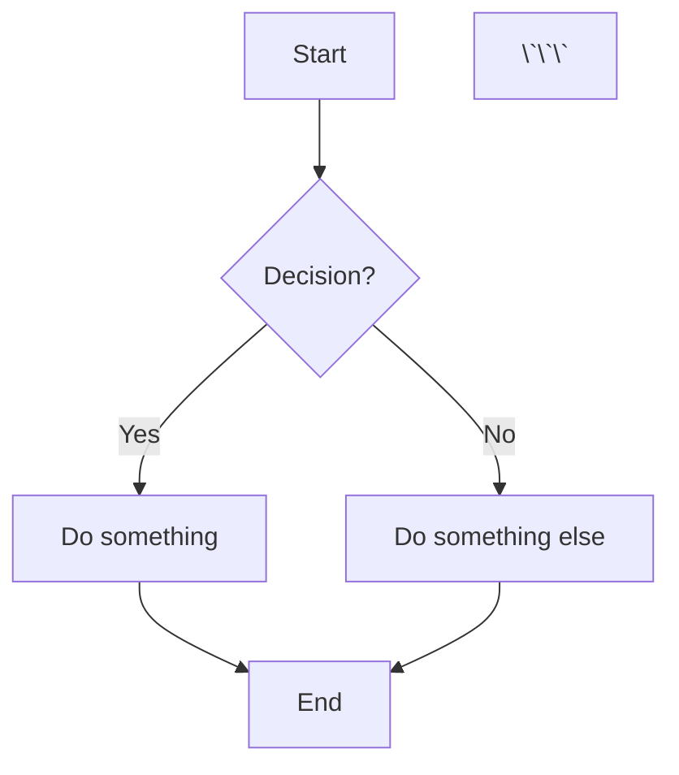

# Markdown Renderer

A React-based Markdown renderer built with **Vite**. This project allows users to upload a Markdown file, renders it with syntax highlighting, and supports **Mermaid diagrams** for visualizing flowcharts, sequence diagrams, and more.


*Replace this with a real screenshot or GIF of your app.*

---

## Features

- **Markdown Rendering**: Upload and render Markdown files with support for headings, lists, code blocks, and more.
- **Syntax Highlighting**: Code blocks are highlighted using `highlight.js`.
- **Mermaid Diagrams**: Render Mermaid diagrams (e.g., flowcharts, sequence diagrams) embedded in Markdown.
- **GitHub-like Styling**: Markdown is styled to look like GitHub READMEs using `github-markdown-css`.

---

## Getting Started

### Prerequisites

- Node.js (v18 or higher)
- npm (v9 or higher)

### Installation

1. Clone the repository:
  ```bash
  git clone https://github.com/your-username/markdown-renderer.git
  cd markdown-renderer
  ```
2. Install dependencies:
  ```bash
  npm install
  ```

3. Start the development server:
  ```bash
  npm run dev
  ```
Open your browser and navigate to `http://localhost:5173`.

### Usage

1. Upload a Markdown File:

* On the homepage, click the file input to upload a Markdown file (.md).

2. View Rendered Markdown:

* The app will render the Markdown with syntax highlighting and Mermaid diagrams.

3. Example Markdown:

Here’s an example Markdown file you can use to test the app:

``` markdown
# My Project

This is a sample README file.

## Features

- Feature 1
- Feature 2
- Feature 3

## Installation

```bash
npm install my-project

### Usage
```javascript

    const myProject = require("my-project");
    myProject.doSomething();

### Diagram Example

Here’s a flowchart:



### Contributing

Pull requests are welcome! Please follow the contribution guidelines.

## Folder Structure

```
markdown-renderer/
├── public/
├── src/
│   ├── components/
│   │   ├── FileUpload.jsx
│   │   └── MarkdownRenderer.jsx
│   ├── pages/
│   │   ├── UploadPage.jsx
│   │   └── RenderPage.jsx
│   ├── App.jsx
│   ├── main.jsx
│   └── index.css
├── .gitignore
├── index.html
├── package.json
├── README.md
└── vite.config.js
```

## Contributing

Contributions are welcome! Please follow these steps:

1. Fork the repository.

2. Create a new branch (`git checkout -b feature/YourFeatureName`).

3. Commit your changes (`git commit -m 'Add some feature'`).

4. Push to the branch (`git push origin feature/YourFeatureName`).

5. Open a pull request.

## License

This project is licensed under the MIT License. See the LICENSE file for details.

## Acknowledgments

* [React](): A JavaScript library for building user interfaces.
* [Vite](): A fast build tool for modern web development.
* [marked](): A Markdown parser and compiler.
* [highlight.js](): Syntax highlighting for code blocks.
* [Mermaid](): A library for rendering diagrams and flowcharts.
* [github-markdown-css](): GitHub-like styling for Markdown content.
